# StudentManagementApp Features

<details>
<summary>Mục lục</summary>

- [StudentManagementApp Features](#studentmanagementapp-features)
  - [Description](#description)
    - [Features Requirement](#features-requirement)
      - [1. Import danh sách sinh viên từ file excel (.xlsx)](#1-import-danh-sách-sinh-viên-từ-file-excel-xlsx)
      - [2. Lưu trữ danh sách sinh viên](#2-lưu-trữ-danh-sách-sinh-viên)
      - [3. Tìm kiếm sinh viên](#3-tìm-kiếm-sinh-viên)
      - [4. Thêm mới sinh viên](#4-thêm-mới-sinh-viên)
      - [5. Xóa sinh viên](#5-xóa-sinh-viên)
      - [6. Thống kê sinh viên](#6-thống-kê-sinh-viên)
      - [7. Sắp xếp danh sách sinh viên](#7-sắp-xếp-danh-sách-sinh-viên)
    - [Features Enhancement](#features-enhancement)
      - [1. Thêm chức năng sắp xếp danh sách sinh viên theo nhiều tiêu chí](#1-thêm-chức-năng-sắp-xếp-danh-sách-sinh-viên-theo-nhiều-tiêu-chí)
      - [2. Thêm chức năng export danh sách sinh viên ra file excel (.xlsx)](#2-thêm-chức-năng-export-danh-sách-sinh-viên-ra-file-excel-xlsx)
      - [3. Thêm tính năng phiên làm việc](#3-thêm-tính-năng-phiên-làm-việc)
      - [4. Thêm chức năng thống kê chi tiết điểm sinh viên](#4-thêm-chức-năng-thống-kê-chi-tiết-điểm-sinh-viên)
      - [5. Thêm chức năng cập nhật thông tin sinh viên](#5-thêm-chức-năng-cập-nhật-thông-tin-sinh-viên)
      - [6. Một số chức năng khác](#6-một-số-chức-năng-khác)

</details>

## Description

- Cấu trúc StudentManagementApp được xây dựng theo [Model-View Design Pattern](https://doc.qt.io/qt-6/model-view-programming.html)

- Thiết kế chương trình xoay quanh Entity `Student` với mô tả các thông tin của sinh viên như sau:

  ```mermaid
  classDiagram
    class Student {
      -string _idStudent
      -string _firstName
      -string _lastName
      -string _idClass
      -string  _score
      +Student()
      +Student(string idStudent, string firstName, string lastName, string idClass, string score)
      +getIdStudent() string
      +setIdStudent(idStudent: string) void
      +getFirstName() string
      +setFirstName(firstName: string) void
      +getLastName() string
      +setLastName(lastName: string) void
      +getIdClass() string
      +setIdClass(idClass: string) void
    }
  ```

- Như phần mô tả trên, chương trình sẽ cung cấp 2 tầng chính:

  1. **Models**: Bao gồm 2 module

     - `OverviewController`: Quản lý các chức năng chính của ứng dụng quản lý sinh viên.
     - `StatisticsController`: Quản lý các chức năng thống kê của ứng dụng quản lý sinh viên.
     - `StudentManagement`: Là thành phần kết nối giữa `OverviewController` và `StatisticsController`.

  2. **Views**: Các thiết kế giao diện nằm trong thư mục [content](../content/)

- Về xử lý dữ liệu, chương trình lưu trữ thông tin sinh viên in-memory, các thuộc tính của sinh viên lưu trữ dưới dạng **[QString](https://doc.qt.io/qt/qstring.html)**:
  - Chuỗi lưu trũ, hiển thị, các phép toán so sánh giua các chuỗi,... có mã hoá `Unicode` (UTF-16), có thể xử lý các từ tiếng Việt.
  - Các thuộc tính về `Student` được **Validate** như sau với biểu thức chính quy:
    - `Id Student`:

      ```cpp
      const std::regex StudentValidator::RegularExpressionStudentId = std::regex("^(n|N)\\d{2}[c-dC-D]{2}[a-zA-Z]{2}\\d{3}$");
      ```

    - `First Name`, `Last Name`:

      ```cpp
      const std::regex StudentValidator::RegularExpressionStudentName = std::regex("^[a-zA-Z_ÀÁÂÃÈÉÊÌÍÒÓÔÕÙÚĂĐĨŨƠàáâãèéêìíòóôõùúăđĩũơƯĂẠẢẤẦẨẪẬẮẰẲẴẶ+"
               "ẸẺẼỀỀỂưăạảấầẩẫậắằẳẵặẹẻẽềềểỄỆỈỊỌỎỐỒỔỖỘỚỜỞỠỢỤỦỨỪễệỉịọỏốồổỗộớờởỡợ+ụủứừỬỮỰỲỴÝỶỸửữựỳỵỷỹ\\s]+$");
      ```

    - `Id Class`:

      ```cpp
      const std::regex StudentValidator::RegularExpressionStudentClass = std::regex("^(d|D)\\d{2}[a-zA-Z]{1,6}\\d{2}-(n|N)$");
      ```

    - `Score`:

      ```cpp
      const std::regex StudentValidator::RegularExpressionStudentScore = std::regex("^([0-9]|10)$");
      ```

### Features Requirement

Đây là những yêu cầu chức năng cần phải thực hiện trong ứng dụng quản lý sinh viên, để rõ hơn về các yêu cầu chức năng, hãy xem tại [đây](./FeatureRequest.md).

#### 1. Import danh sách sinh viên từ file excel (.xlsx)

- Mô tả: Cho phép người dùng nhập danh sách sinh viên từ file excel (.xlsx) gồm các thông tin sau:
  - Mã sinh viên (số + chữ)
  - Họ
  - Tên sinh viên
  - Lớp
  - Điểm

> :bulb: **Note**:
>
> 1. Hiện tại app chỉ hỗ trợ đọc file excel (.xlsx) với định dạng như sau:
>
>     <figure>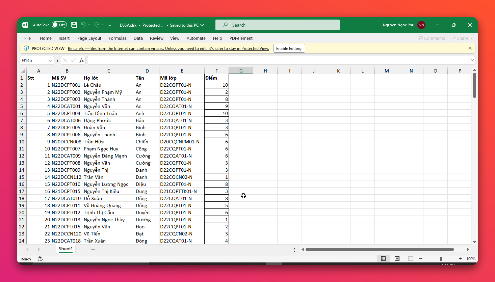<figcaption>Định dạng file excel (.xlsx) cho phép import danh sách sinh viên</figcaption>
>
> 2. Các định dạng file khác bao gồm `.xls`, `.csv`, `.txt` sẽ được hỗ trợ trong tương lai (hiện tại chưa hỗ trợ, vì vậy khi import file không phải định dạng `.xlsx` **sẽ báo lỗi**).
> 3. Nếu các hàng, cột trong file excel không đúng định dạng như trên thì **sẽ bỏ qua**.

- Cách hoạt động:
  - Tại màn hình chính, người dùng di chuyển chuột đến nút `Import` và click chuột.
  
    <figure>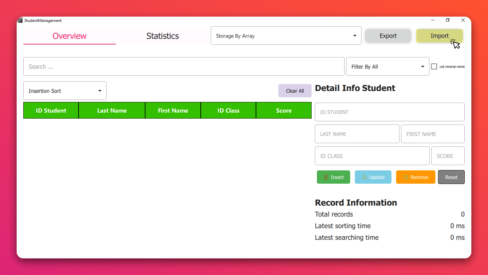<figcaption>Import danh sách sinh viên từ file excel (.xlsx)</figcaption></figure>

  - Chọn file excel `(*.xlsx)` cần **import**.
  
    <figure>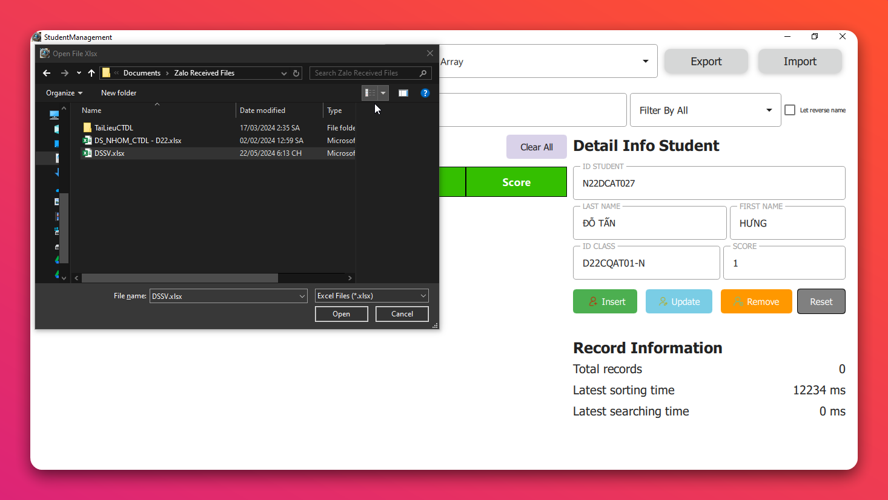<figcaption>Chọn file excel (.xlsx) cần import</figcaption></figure>

- Kết quả:
  - Hiển thị danh sách sinh viên đã import thành công.
  - Nếu có lỗi, hiển thị thông báo lỗi.
  
    <figure>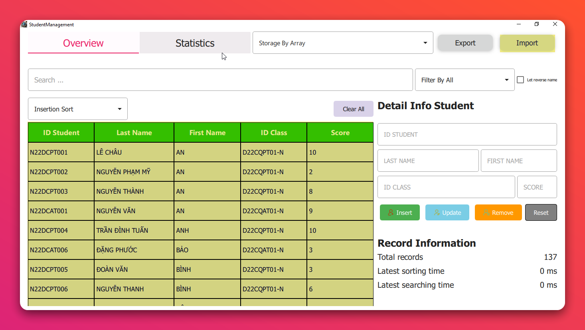<figcaption>Hiển thị danh sách sinh viên sau khi import thành công</figcaption></figure>

#### 2. Lưu trữ danh sách sinh viên

- Mô tả: Cho phép người dùng chọn cách thức lưu trữ danh sách sinh viên bằng:
  - Mảng
  - Danh sách liên kết đơn
  - Danh sách liên kết vòng
  - Danh sách liên kết kép
- Cách hoạt động:
  - Tại màn hình chính, người dùng di chuyển chuột đến `ComboBox` có tên `Storage ...` và chọn cách thức lưu trữ danh sách sinh viên.
  
    <figure>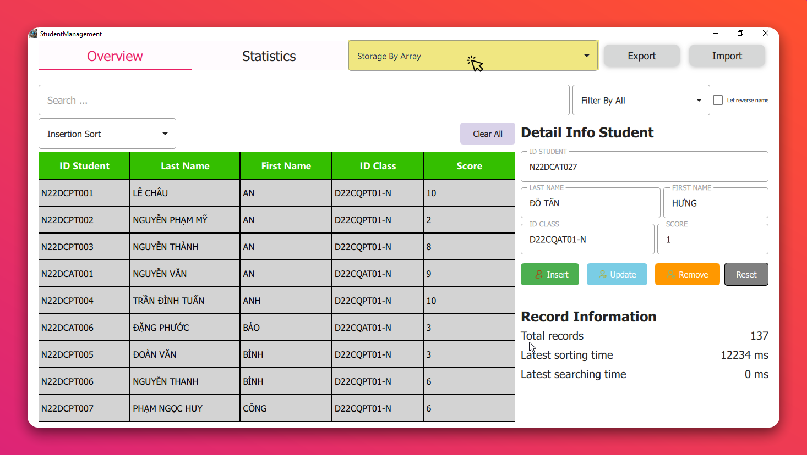<figcaption>Chọn cách thức lưu trữ danh sách sinh viên</figcaption></figure>

    <figure>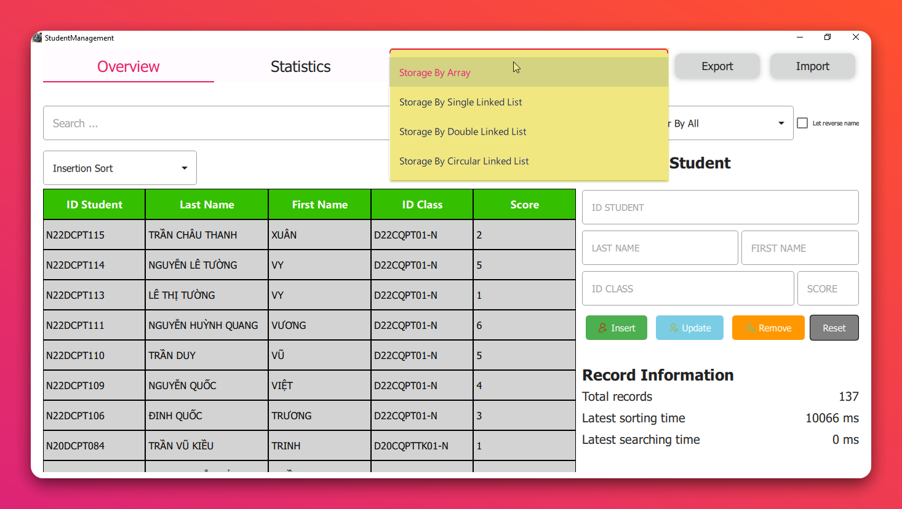<figcaption>Chọn cách thức lưu trữ danh sách sinh viên</figcaption></figure>

- Kết quả:
  - Hiển thị danh sách sinh viên đã lưu trữ theo cách thức đã chọn.

#### 3. Tìm kiếm sinh viên

- Mô tả:
  - Cho phép người dùng nhập điều kiện tìm kiếm sinh viên dựa trên 1 trong các tiêu chí sau:
    - Mã sinh viên
    - Họ
    - Tên
    - Lớp
    - Điểm
  - Cho phép chọn yêu cầu xuất đảo ngược thông tin họ và tên các sinh viên được tìm thấy.
  - Trong kết quả hiển thị, in đậm / tô đỏ thông tin sinh viên tương ứng tiêu chí đang tìm kiếm.
  - Hiển thị thời gian tìm kiếm (đơn vị: ms).
- Cách hoạt động:
  - Tại màn hình chính, người dùng nhập thông tin cần tìm kiếm vào ô `Search ...` và nhấn `Enter`.
  
    <figure>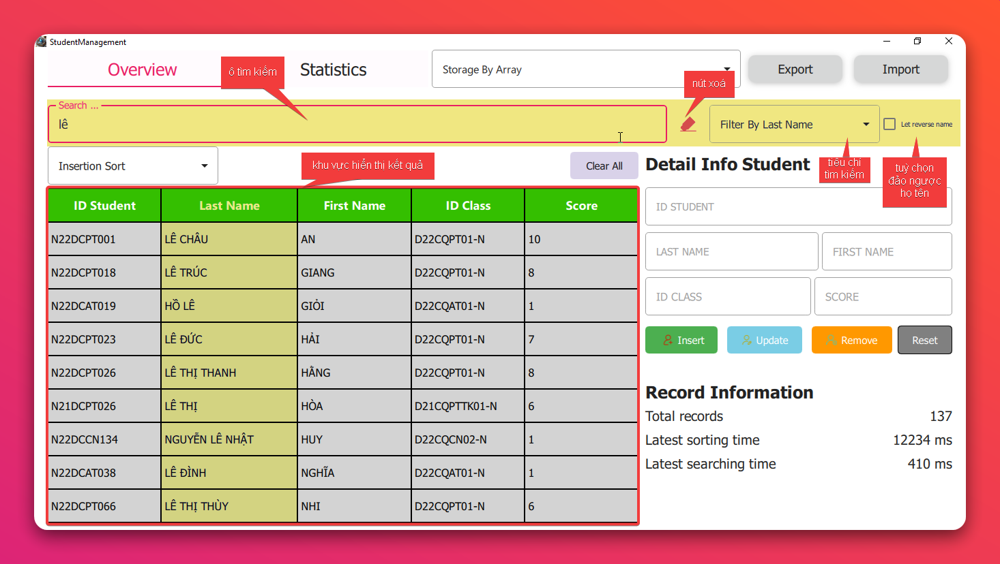<figcaption>Tìm kiếm sinh viên theo tiêu chí</figcaption></figure>
  
  - Để xuất đảo ngược thông tin họ và tên sinh viên, người dùng chọn `CheckBox` có tên `Let reverse name`.

    <figure>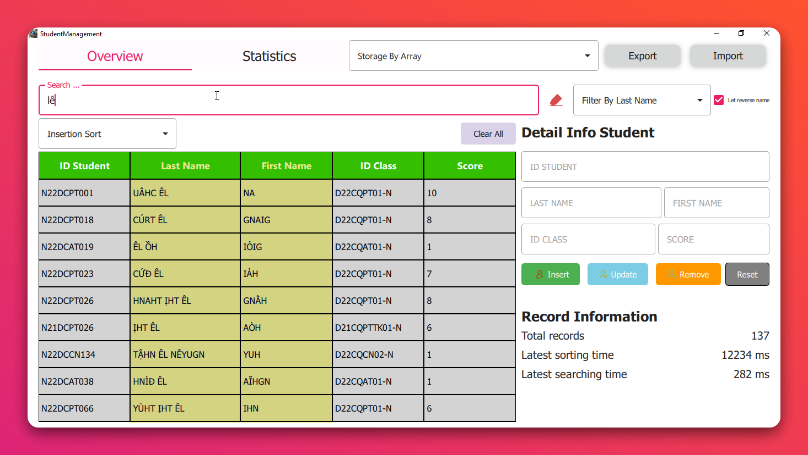<figcaption>Xuất đảo ngược thông tin họ và tên sinh viên</figcaption></figure>
  
  - Thời gian tìm kiếm sẽ được hiển thị sau khi tìm kiếm xong.

    <figure>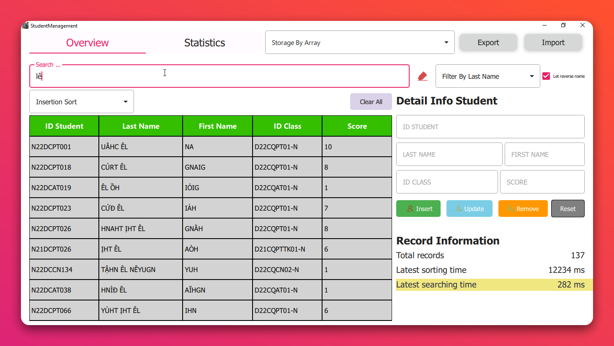<figcaption>Thời gian tìm kiếm sinh viên</figcaption></figure>

    > :bulb: **Note**:
    > - Khi nhập thông tin tìm kiếm, chương trình hỗ trợ tìm kiếm không phân biệt **chữ hoa** hay **chữ thường**.
    > - Khi nhập thông tin tìm kiếm, chương trình sẽ tìm kiếm ngay lập tức.
    > - Khi nhập thông tin tìm kiếm, chương trình sẽ hiển thị kết quả **tìm kiếm ngay lập tức, tính năng này sẽ thay thế cho tính năng tô đỏ thông tin sinh viên tương ứng tiêu chí đang tìm kiếm**.
  
- Kết quả:
  - Hiển thị danh sách sinh viên tìm kiếm được.
  - Đảo ngược thông tin họ và tên sinh viên nếu được chọn.
  - Thời gian tìm kiếm.

#### 4. Thêm mới sinh viên

- Mô tả:
  - Cho phép người dùng thêm mới sinh viên với các thông tin sau:
    - Mã sinh viên (`Id Student`)
    - Họ (`First Name`)
    - Tên (`Last Name`)
    - Lớp (`Id Class`)
    - Điểm (`Score`)
- Cách hoạt động:
  - Tại `Tab Overview`, người dùng hãy điền thông tin sinh viên cần thêm vào các ô tương ứng tại khu vực `Detail Info Student`.
  - Sau khi điền đầy đủ thông tin, nhấn nút `Insert` để thêm mới sinh viên.
  
    <figure>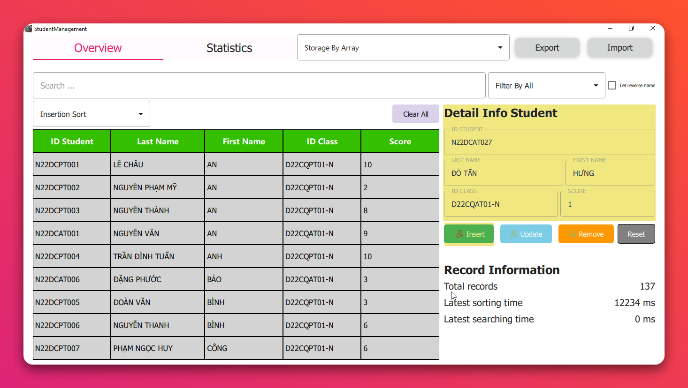<figcaption>Thêm mới sinh viên</figcaption></figure>

  > :bulb: **Note**:
  > 1. Khi thêm sinh viên, chương trình sẽ kiểm tra thông tin sinh viên có đúng định dạng hay không.
  > 2. Khi thêm sinh viên, chương trình sẽ kiểm tra thông tin sinh viên có trùng với sinh viên khác hay không. Nếu trùng, chương trình sẽ hiển thị thông báo tuỳ chọn `Cập nhật thông tin sinh viên`:
  >     - Nhấn `Yes` để cập nhật thông tin sinh viên.
  >     - Nhấn `No` để hủy bỏ thêm sinh viên.
  > 3. Khi thêm mới sinh viên, tuỳ theo cấu trúc lưu trữ danh sách sinh viên, chương trình sẽ thêm sinh viên vào danh sách sinh viên như sau:
  >     - **Mảng**: Thêm vào cuối mảng.
  >     - **Các cấu trúc danh sách liên kết**: Thêm vào đầu danh sách.
  >     **`Đây là tối ưu hóa để giảm thời gian thêm sinh viên.`**

- Kết quả:
  - Thêm sinh viên thành công khi đáp ứng hai điều kiện:
    - Thông tin `Id Student` không trùng với sinh viên nào trong danh sách.
    - Thông tin sinh viên đúng định dạng tại mục [Validate](#description).

#### 5. Xóa sinh viên

- Mô tả:
  - Cho phép người dùng xóa sinh viên tại bất kỳ vị trí nào trong danh sách sinh viên.
- Cách hoạt động:
  - Tại `Tab Overview`, người dùng di chuyển chuột đến bảng danh sách sinh viên.
  - `Click` chuột vào *bất kỳ* ô nào chứa thông tin sinh viên cần xóa.
  - Ô được chọn sẽ được *tô màu* để người dùng nhận biết, đồng thời tại phần `Detail Info Student` sẽ hiển thị thông tin sinh viên cần xóa.
  - Nhấn nút `Remove` để xóa sinh viên.
    - Lúc này, sẽ hiển thị thông báo xác nhận xóa sinh viên.
    - Nhấn `Yes` để xác nhận xóa sinh viên.
    - Nhấn `No` để hủy bỏ xóa sinh viên.

    <figure>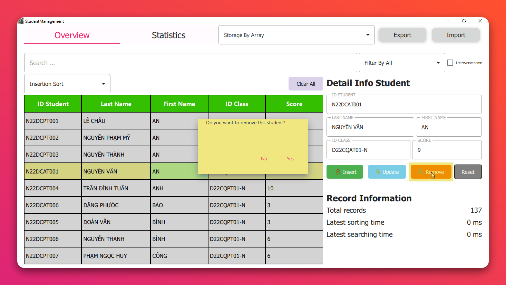<figcaption>Xóa sinh viên</figcaption></figure>

    > :bulb: **Note**:
    > - Nếu không chọn sinh viên nào mà nhấn `Remove`, chương trình sẽ hiển thị thông báo lỗi.

- Kết quả:
  - Xóa sinh viên thành công khi đáp ứng điều kiện:
    - Sinh viên được chọn.
    - Xác nhận xóa sinh viên.

#### 6. Thống kê sinh viên

- Mô tả:
  - Hiển thị các chức năng thống kê sinh viên như:
    - Liệt kê các sinh viên có điểm thấp nhất (Lowest Score).
    - Liệt kê các sinh viên có điểm cao nhất (Highest Score).
    - Tính điểm trung bình của lớp (Average Score).
- Cách hoạt động:
  - Tại màn hình chính, người dùng di chuyển chuột đến `Tab Statistics` và `Click` chuột.
  
    <figure>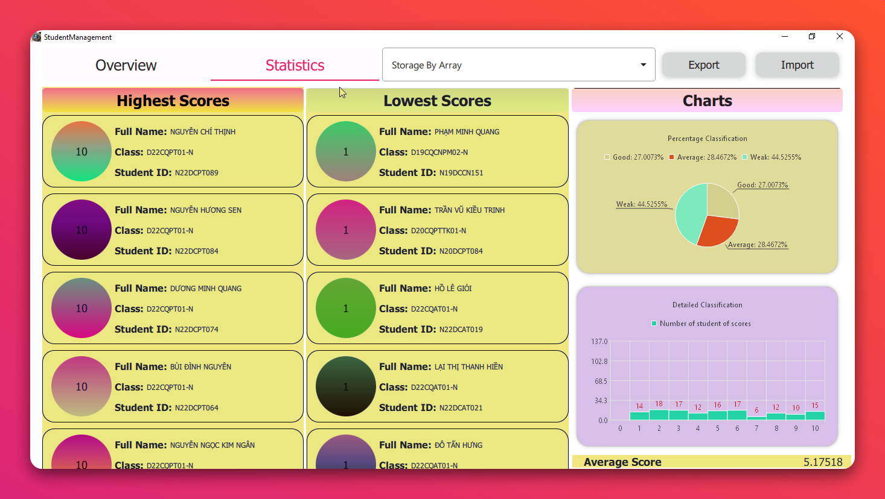<figcaption>Thống kê sinh viên</figcaption></figure>
  
  > :bulb: **Note**: Người dùng có thể cuộn chuột để xem thông tin thống kê sinh viên.

- Kết quả:
  - Hiển thị thông tin thống kê sinh viên như yêu cầu.

#### 7. Sắp xếp danh sách sinh viên

- Mô tả:
  - Cho phép người dùng chọn cách sắp xếp danh sách sinh viên theo:
    - Bubble sort
    - Selection sort
    - Insertion sort
    - Quick sort
    - Merge sort
    - Heap sort
  - Chọn một trong các tiêu chí sắp xếp:
    - Mã SV (`Id Student`)
    - Tên (`First Name`)
    - Điểm (`Score`)
  - Hiển thị kết quả danh sách sau khi sắp xếp và thời gian thực hiện (đơn vị: ms).
- Cách hoạt động:
  - Tại `Tab Overview`, người dùng di chuyển chuột đến `ComboBox` có tên `Sort ...` và chọn cách sắp xếp danh sách sinh viên.
  - Tiếp theo, tại hàng có chứa tiêu đề các cột của bảng danh sách sinh viên, người dùng `Click` chuột vào cột cần sắp xếp.
  - Sau khi sắp xếp xong, chương trình sẽ hiển thị danh sách sinh viên đã sắp xếp và thời gian thực hiện.
  
    <figure>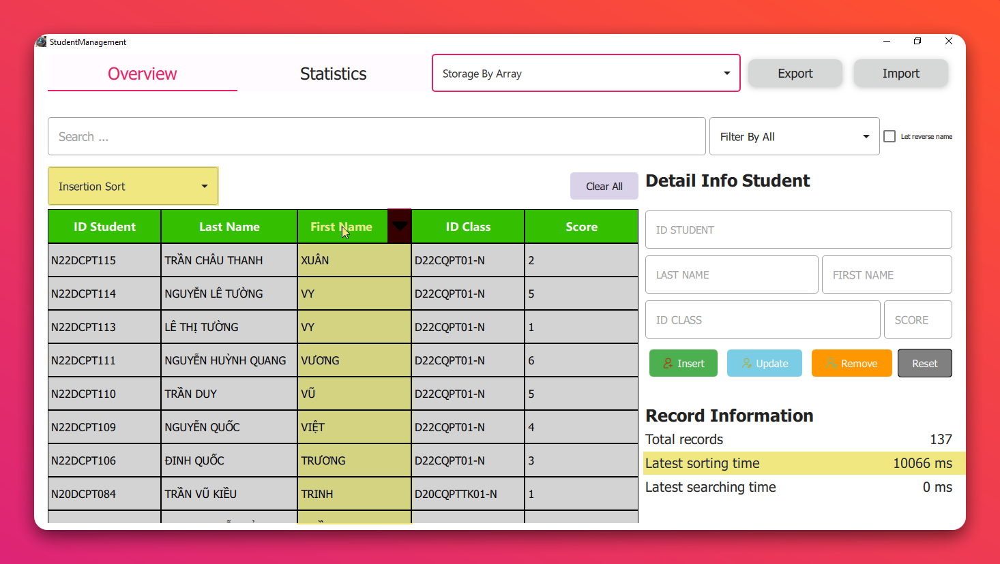<figcaption>Sắp xếp danh sách sinh viên</figcaption></figure>

    <figure>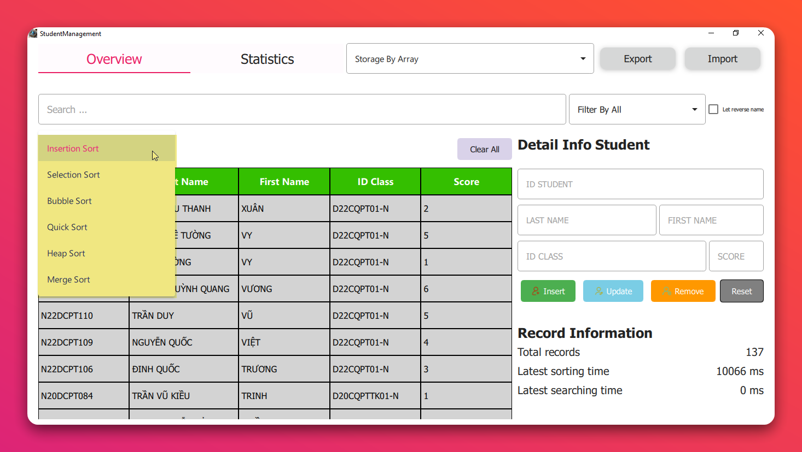<figcaption>Chọn cách sắp xếp danh sách sinh viên</figcaption></figure>

  > :bulb: **Note**:
  > - Chương trình có thể sắp xếp danh sách sinh viên theo với các thuộc tính `First Name`, `Last Name`, theo thứ tự *từ điển Việt Nam*.
  > - Khi sắp xếp danh sách sinh viên, hạn chế thực hiện đồng thời nhiều chức năng khác vì
  >   - Chương trình chỉ ***thiết kế đơn luồng***.
  >   - Truy cập đồng thời vào cùng một **object** có thể gây crash chương trình.

- Kết quả:
  - Hiển thị danh sách sinh viên đã sắp xếp và thời gian thực hiện.

### Features Enhancement

#### 1. Thêm chức năng sắp xếp danh sách sinh viên theo nhiều tiêu chí

- Mô tả:
  - Cho phép người dùng chọn nhiều tiêu chí sắp xếp danh sách sinh viên:
    - Lớp (`Id Class`)
    - Họ (`Last Name`)

- Cách hoạt động: Như mô tả ở [7. Sắp xếp danh sách sinh viên](#7-sắp-xếp-danh-sách-sinh-viên).
- Kết quả: Như mô tả ở [7. Sắp xếp danh sách sinh viên](#7-sắp-xếp-danh-sách-sinh-viên).

#### 2. Thêm chức năng export danh sách sinh viên ra file excel (.xlsx)

- Mô tả:
  - Cho phép người dùng xuất danh sách sinh viên ra file excel (.xlsx) với định dạng như sau:
    - Mã sinh viên
    - Họ
    - Tên sinh viên
    - Lớp
    - Điểm
  - File excel (`*.xlsx`) sẽ được lưu theo định dạng sau:
  
    <figure>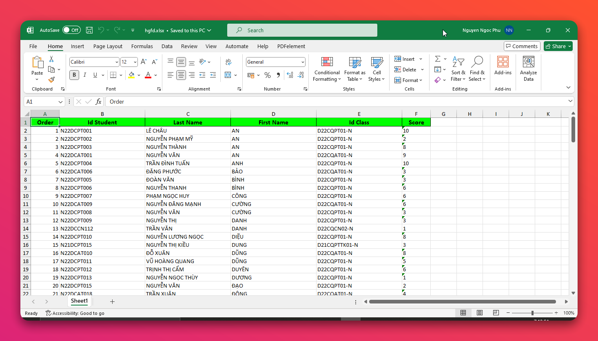<figcaption>Định dạng file excel (.xlsx) cho phép xuất danh sách sinh viên</figcaption>

- Cách hoạt động:
  - Tại màn hình chính, người dùng di chuyển chuột đến nút `Export` và click chuột.
  - Cửa sổ `Save As` sẽ hiển thị, người dùng chọn nơi lưu file và đặt tên file.
  
    <figure>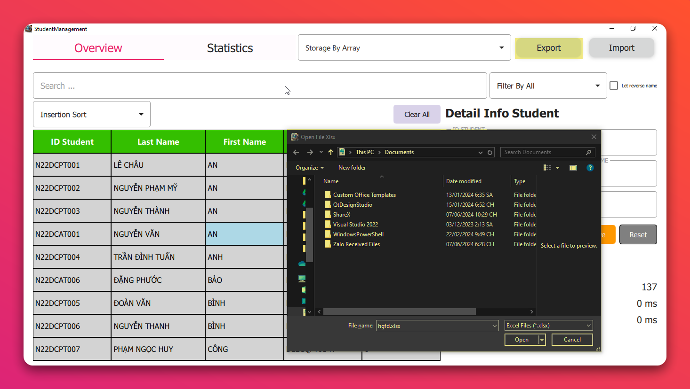<figcaption>Xuất danh sách sinh viên ra file excel (.xlsx)</figcaption></figure>

- Kết quả:
  - File excel (`*.xlsx`) được lưu tại nơi người dùng chọn với định dạng như mô tả.

#### 3. Thêm tính năng phiên làm việc

- Mô tả:
  - Cho phép người dùng lưu lại thông tin sinh viên sau khi thoát ứng dụng.
  - Khi mở lại ứng dụng, thông tin sinh viên sẽ được hiển thị lại.

- Cách hoạt động:
  - Khi người dùng thoát ứng dụng, thông tin sinh viên sẽ được lưu lại.
  - Khi mở lại ứng dụng, thông tin sinh viên sẽ được hiển thị lại.
  - Thông tin sinh viên sẽ được lưu lại dưới dạng file `students.xlsx` tại đường dẫn

    ```bash
        /path_to_app/StudentManagementApp/DataUser/students.xlsx
    ```
  
- Kết quả:
  - Thông tin sinh viên được lưu lại sau khi thoát ứng dụng.
  - Thông tin sinh viên được hiển thị lại khi mở lại ứng dụng.

#### 4. Thêm chức năng thống kê chi tiết điểm sinh viên

- Mô tả:
  - Cho phép người dùng xem chi tiết điểm của các sinh viên theo dạng biểu đồ.
    - **Biểu đồ tròn**: Hiển thị tỷ lệ phần trăm điểm của sinh viên:
      - Điểm từ 8 - 10: `Good`
      - Điểm từ 5 - 7: `Average`
      - Điểm từ 0 - 4: `Weak`
    - **Biểu đồ cột**: Hiển thị điểm của từng sinh viên:
      - Mỗi cột biểu đồ tương ứng với tổng số sinh viên đạt được điểm đó.
      - Gồm 10 cột biểu đồ tương ứng với điểm từ 0 - 10.
- Cách hoạt động: tương tự như mô tả ở [6. Thống kê sinh viên](#6-thống-kê-sinh-viên).
  
    <figure>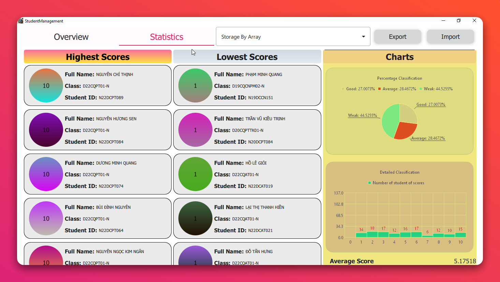<figcaption>Thống kê chi tiết điểm sinh viên</figcaption></figure>
- Kết quả: Như mô tả ở [6. Thống kê sinh viên](#6-thống-kê-sinh-viên).

#### 5. Thêm chức năng cập nhật thông tin sinh viên

- Mô tả:
  - Cho phép người dùng cập nhật thông tin sinh viên sau khi sinh viên đã `tồn tại` trong danh sách.
- Cách hoạt động:
  - Tại `Tab Overview`, người dùng chọn sinh viên cần cập nhật thông tin.
  - Thông tin sinh viên sẽ được hiển thị tại khu vực `Detail Info Student`.
  - Người dùng cập nhật thông tin sinh viên cần thay đổi.
  - Nhấn nút `Update` để cập nhật thông tin sinh viên.
  
    <figure><figcaption>Cập nhật thông tin sinh viên</figcaption></figure>

  > :bulb: **Note**:
  > - Khi cập nhật thông tin sinh viên, chương trình sẽ kiểm tra thông tin sinh viên cập nhật có đúng định dạng hay không.
  > - Khi cập nhật thông tin sinh viên, chương trình sẽ kiểm tra thông tin sinh viên cập nhật có id trùng với sinh viên khác hay không.
  > - Nếu không thỏa mãn điều kiện trên, chương trình sẽ hiển thị thông báo lỗi.

- Kết quả:
  - Cập nhật thông tin sinh viên thành công khi đáp ứng điều kiện:
    - Sinh viên được chọn.
    - Thông tin sinh viên cập nhật đúng định dạng.

#### 6. Một số chức năng khác

- Mô tả:
  1. Thêm chức năng `Clear All` để xóa toàn bộ danh sách sinh viên.
  2. Thêm chức năng hiển thị **tổng số sinh viên** trong danh sách.
  3. Nút `Reset` để làm mới khu vực nhập thông tin sinh viên.
- Cách hoạt động:
  1. Tại `Tab Overview`, người dùng di chuyển chuột đến nút `Clear All` và click chuột.
     - Hiển thị thông báo xác nhận xóa toàn bộ danh sách sinh viên.
     - Nhấn `Yes` để xác nhận xóa toàn bộ danh sách sinh viên.
     - Nhấn `No` để hủy bỏ xóa toàn bộ danh sách sinh viên.
  2. Tại `Tab Overview`, hiển thị tổng số sinh viên trong danh sách.
  3. Tại `Tab Overview`, người dùng di chuyển chuột đến nút `Reset` và click chuột.
  
    <figure>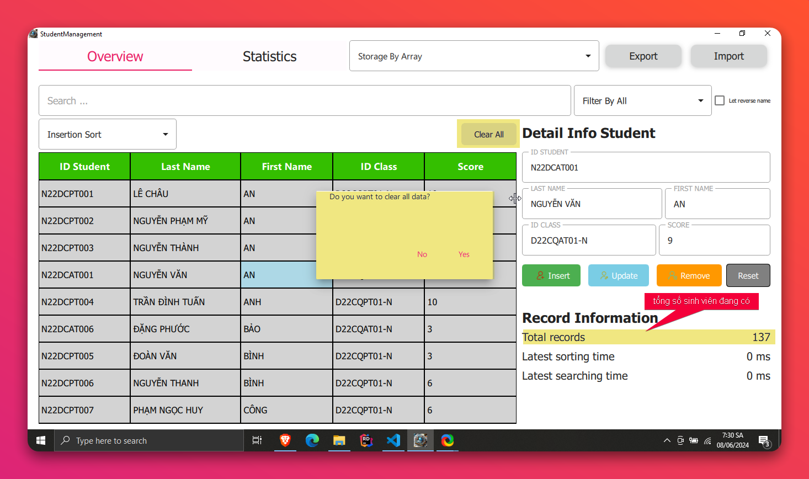<figcaption>Xóa toàn bộ danh sách sinh viên</figcaption></figure>
